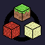

<br/>
<div align="center">
<a href="https://github.com/senseiwells/Multiverse">

</a>
<h3 align="center">Multiverse</h3>
<p align="center">
A fabric mod for Minecraft that allows creating custom dimensions at runtime with commands!
</p>
</div>

## About The Project

This is a server-side fabric mod that provides a few simple commands for creating custom dimensions at runtime.

The motivation for this when building in creative, whether working on decorative builds or working with redstone it can be beneficial to work in a separate dimension.

## Getting Started

The mod can be installed from modrinth:

[![Modrinth download](https://img.shields.io/modrinth/dt/multiverse-dimensions?label=Download%20on%20Modrinth&style=for-the-badge&logo=data:image/svg+xml;base64,PHN2ZyB4bWxucz0iaHR0cDovL3d3dy53My5vcmcvMjAwMC9zdmciIHhtbDpzcGFjZT0icHJlc2VydmUiIGZpbGwtcnVsZT0iZXZlbm9kZCIgc3Ryb2tlLWxpbmVqb2luPSJyb3VuZCIgc3Ryb2tlLW1pdGVybGltaXQ9IjEuNSIgY2xpcC1ydWxlPSJldmVub2RkIiB2aWV3Qm94PSIwIDAgMTAwIDEwMCI+PHBhdGggZmlsbD0ibm9uZSIgZD0iTTAgMGgxMDB2MTAwSDB6Ii8+PGNsaXBQYXRoIGlkPSJhIj48cGF0aCBkPSJNMTAwIDBIMHYxMDBoMTAwVjBaTTQ2LjAwMiA0OS4yOTVsLjA3NiAxLjc1NyA4LjgzIDMyLjk2MyA3Ljg0My0yLjEwMi04LjU5Ni0zMi4wOTQgNS44MDQtMzIuOTMyLTcuOTk3LTEuNDEtNS45NiAzMy44MThaIi8+PC9jbGlwUGF0aD48ZyBjbGlwLXBhdGg9InVybCgjYSkiPjxwYXRoIGZpbGw9IiMwMGQ4NDUiIGQ9Ik01MCAxN2MxOC4yMDcgMCAzMi45ODggMTQuNzg3IDMyLjk4OCAzM1M2OC4yMDcgODMgNTAgODMgMTcuMDEyIDY4LjIxMyAxNy4wMTIgNTAgMzEuNzkzIDE3IDUwIDE3Wm0wIDljMTMuMjQgMCAyMy45ODggMTAuNzU1IDIzLjk4OCAyNFM2My4yNCA3NCA1MCA3NCAyNi4wMTIgNjMuMjQ1IDI2LjAxMiA1MCAzNi43NiAyNiA1MCAyNloiLz48L2c+PGNsaXBQYXRoIGlkPSJiIj48cGF0aCBkPSJNMCAwdjQ2aDUwbDEuMzY4LjI0MUw5OSA2My41NzhsLTIuNzM2IDcuNTE3TDQ5LjI5NSA1NEgwdjQ2aDEwMFYwSDBaIi8+PC9jbGlwUGF0aD48ZyBjbGlwLXBhdGg9InVybCgjYikiPjxwYXRoIGZpbGw9IiMwMGQ4NDUiIGQ9Ik01MCAwYzI3LjU5NiAwIDUwIDIyLjQwNCA1MCA1MHMtMjIuNDA0IDUwLTUwIDUwUzAgNzcuNTk2IDAgNTAgMjIuNDA0IDAgNTAgMFptMCA5YzIyLjYyOSAwIDQxIDE4LjM3MSA0MSA0MVM3Mi42MjkgOTEgNTAgOTEgOSA3Mi42MjkgOSA1MCAyNy4zNzEgOSA1MCA5WiIvPjwvZz48Y2xpcFBhdGggaWQ9ImMiPjxwYXRoIGQ9Ik01MCAwYzI3LjU5NiAwIDUwIDIyLjQwNCA1MCA1MHMtMjIuNDA0IDUwLTUwIDUwUzAgNzcuNTk2IDAgNTAgMjIuNDA0IDAgNTAgMFptMCAzOS41NDljNS43NjggMCAxMC40NTEgNC42ODMgMTAuNDUxIDEwLjQ1MSAwIDUuNzY4LTQuNjgzIDEwLjQ1MS0xMC40NTEgMTAuNDUxLTUuNzY4IDAtMTAuNDUxLTQuNjgzLTEwLjQ1MS0xMC40NTEgMC01Ljc2OCA0LjY4My0xMC40NTEgMTAuNDUxLTEwLjQ1MVoiLz48L2NsaXBQYXRoPjxnIGNsaXAtcGF0aD0idXJsKCNjKSI+PHBhdGggZmlsbD0ibm9uZSIgc3Ryb2tlPSIjMDBkODQ1IiBzdHJva2Utd2lkdGg9IjkiIGQ9Ik01MCA1MCA1LjE3MSA3NS44ODIiLz48L2c+PGNsaXBQYXRoIGlkPSJkIj48cGF0aCBkPSJNNTAgMGMyNy41OTYgMCA1MCAyMi40MDQgNTAgNTBzLTIyLjQwNCA1MC01MCA1MFMwIDc3LjU5NiAwIDUwIDIyLjQwNCAwIDUwIDBabTAgMjUuMzZjMTMuNTk5IDAgMjQuNjQgMTEuMDQxIDI0LjY0IDI0LjY0UzYzLjU5OSA3NC42NCA1MCA3NC42NCAyNS4zNiA2My41OTkgMjUuMzYgNTAgMzYuNDAxIDI1LjM2IDUwIDI1LjM2WiIvPjwvY2xpcFBhdGg+PGcgY2xpcC1wYXRoPSJ1cmwoI2QpIj48cGF0aCBmaWxsPSJub25lIiBzdHJva2U9IiMwMGQ4NDUiIHN0cm9rZS13aWR0aD0iOSIgZD0ibTUwIDUwIDUwLTEzLjM5NyIvPjwvZz48cGF0aCBmaWxsPSIjMDBkODQ1IiBkPSJNMzcuMjQzIDUyLjc0NiAzNSA0NWw4LTkgMTEtMyA0IDQtNiA2LTQgMS0zIDQgMS4xMiA0LjI0IDMuMTEyIDMuMDkgNC45NjQtLjU5OCAyLjg2Ni0yLjk2NCA4LjE5Ni0yLjE5NiAxLjQ2NCA1LjQ2NC04LjA5OCA4LjAyNkw0Ni44MyA2NS40OWwtNS41ODctNS44MTUtNC02LjkyOVoiLz48L3N2Zz4=)](https://modrinth.com/mod/multiverse-dimensions)

## Usage

After installing the mod the `/multiverse` command should become available to operators.
The permissions for the command can also be modified using a permissions mod, [see the
permissions section](#permissions).

The command is quite simple, with only a few subcommands. 
Let's first discuss how to create a custom dimension.

### Creating Custom Dimensions

To create a custom dimension we will use the `create` subcommand.
There are 2 branches from the `create` subcommand:
```mcfunction
/multiverse create from <dimension-type> <dimension-id> <seed?> <has-custom-gamerules?> <has-custom-tickrate?>
/multiverse create vanilla <overworld> <nether> <end> <seed?>
```
In the first, `from`, we can specify a pre-defined dimension type, give our dimension a
namespaced identifier, optionally specify a seed (otherwise random), and also specify
whether the dimension should have its own gamerules or whether it should inherit
its gamerules. 
Finally, you can also specify whether the `/tick` command will work independently for
that specific dimension. 
If set to `true` any `/tick` commands run inside that dimension will affect *only* that
specific dimension, `/tick` run in any dimension that doesn't have a custom tickrate
will also only affect dimensions that also don't have a custom tickrate.

Dimension types define how the terrain is generated as well as some behaviors
which you can find listed on the [Minecraft wiki](https://minecraft.wiki/w/Dimension_type).
By default, vanilla has 3 types: `minecraft:overworld`, `minecraft:the_nether`, and 
`minecraft:the_end`.

Multiverse adds 2 types: `multiverse:void` and `multiverse:white_glass`, generating a
void world and a flat world with one layer of white glass respectively.

You can also define your own dimension types for more control, see [the defining 
custom dimension types section](#defining-custom-dimension-types).

The specified dimension id can be any namespaced id as long as no existing dimension has
that id, for example you cannot use `minecraft:overworld` because vanilla uses that id.

Here's an example command to create a dimension called `example:my_dimension` that is
a glass superflat world with a random seed with its own gamerules:
```mcfunction
/multiverse create from multiverse:white_glass example:my_dimension random true
```

The second `vanilla` allows you to create a set of 3 dimensions that mirror the behavior
of vanilla's 3 dimensions.

Here's an example command:
```mcfunction
/multiverse create vanilla example:my_overworld example:my_nether example:my_end
```
This will create 3 dimensions, `example:my_overworld`, `example:my_nether`, and
`example:my_end` with overworld, nether, and end generation respectively.
`example:my_overworld` and `example:my_nether` can be linked with nether portals
and will behave just like `minecraft:overworld` and `minecraft:the_nether` would.
The same is true for the end portal. 
It is worth noting that returning back through the end portal will put the player
at their spawn, or at global spawn (which may still be in `minecraft:overworld`).

Additionally, the generated end dimension *will* spawn the ender dragon.

### Teleporting to Custom Dimensions

Multiverse provides a command to teleport to different dimensions:
```mcfunction
/multiverse teleport <dimension> <position?> <rotation?>
```


### Deleting Custom Dimensions

Deleting custom dimensions is very simple:
```mcfunction
/multiverse delete <dimension>
```
Running this command won't immediately delete your dimension, instead it will ask you
to confirm whether you truly want to delete the dimension as this action is destructive
and cannot be undone.

Running `/multiverse delete <dimension> force` will bypass this prompt.

### Cloning Dimensions

Multiverse allows you to clone any dimension, this may be useful when iterating
on a build or for when you need to test the behavior of a redstone contraption.

You will likely want to run `/save-all` prior to cloning a dimension to ensure that
it's cloned in its most up-to-date state.

The command is as follows:
```mcfunction
/multiverse clone <from-dimension> <to-dimension> <has-custom-tickrate?> <region-from?> <region-to?>
```
Where `<from-dimension>` is the existing dimension you want to clone from,
and `<to-dimension>` is the namespaced id you want to create as a clone.

You can also specify whether the cloned dimension will have its own custom
tickrate manager, for more details read [the creating custom dimensions
section](#creating-custom-dimensions).

Finally, you can also specify a [region area](https://minecraft.wiki/w/Chunk_format) 
to clone, you may also only specify one region in which case only that region will be cloned, 
if unspecified the *entire* dimension will be copied. 
This is not recommended as dimensions which take up a lot of storage as it copies 
*all* region files, and it also may hang your server.

### Dimension Files

Multiverse's dimensions are located in your `world/dimensions/<namespace>/<path>` directory,
for example, if you create a dimension called `example:world` then your dimension files will be
in `world/dimensions/example/world`.
From here the structure of worlds is the same as the overworld/nether/end.

### Defining Custom Dimension Types

Multiverse allows you to define your own custom dimension types in a datapack!

Here's a guide on how to create a datapack on the [Minecraft wiki](https://minecraft.wiki/w/Tutorial:Creating_a_data_pack).

The format is exactly the same as if you were to define a custom dimension for
vanilla to load but just in a different directory.
You can follow this tutorial on the [Minecraft wiki](https://minecraft.wiki/w/Tutorial:Adding_a_new_dimension)
on how to create a new dimension but instead of putting your dimension files in
`data/<namespace>/dimension/<path>.json` you should put your dimension files in
`data/<namespace>/multiverse/dimension/<path>.json`.

Custom dimension types should still be registered at 
`data/<namespace>/dimension_type/<path>.json`.

There is an example datapack in this repository which you can download as a template
[here](https://github.com/senseiwells/Multiverse/raw/refs/heads/1.21.8/docs/example_datapack.zip),
or you can view it [here](https://github.com/senseiwells/Multiverse/tree/1.21.8/docs/example_datapack).

### Permissions

You can further customize access of the commands through the use of a permissions mod
such as [LuckPerms](https://luckperms.net/).
The permission `"multiverse.commands.multiverse"` grants the `/multiverse` command with 
further more specific permissions for the subcommands:
- `"multiverse.commands.multiverse.create"`
- `"multiverse.commands.multiverse.clone"`
- `"multiverse.commands.multiverse.delete"`
- `"multiverse.commands.multiverse.teleport"`

## License

Distributed under the MIT License. See [MIT License](https://opensource.org/licenses/MIT) for more information.
